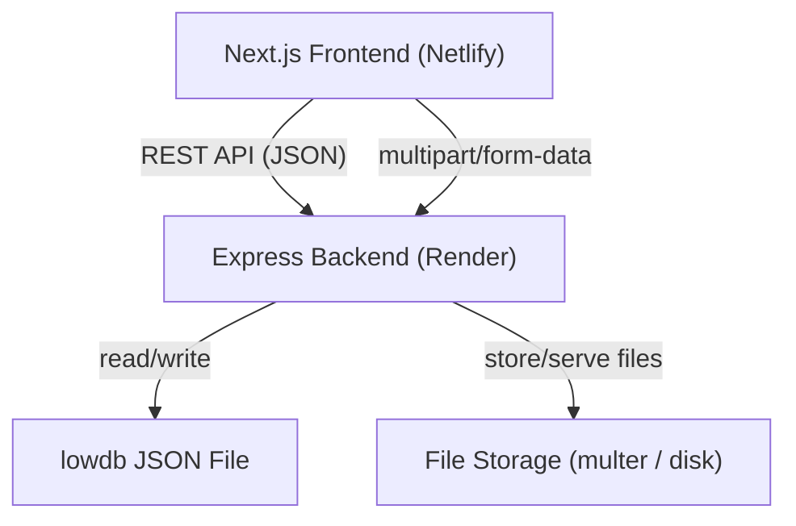

# Design Document — Platform Enhancements

## Overview

This document describes the technical design for 12 platform enhancements to Beyond Classroom, a math learning platform. The enhancements span quiz management (image/PDF/Excel upload, createdBy tracking), module PDF uploads, student content downloads, analytics improvements, 5-star feedback, homepage featured/recent course sections, default newest-first ordering, and a grade-wise course hierarchy.

The system uses a Next.js App Router frontend (Netlify) and a Node.js/Express backend with lowdb (JSON file DB) on Render. File uploads are handled server-side using `multer`. There is no cloud storage — files are stored on the Render filesystem (ephemeral). For production persistence, a cloud storage provider (e.g. Cloudinary or S3) should be used; this design treats the upload path as an abstraction that can be swapped.

---

## Architecture



All new features follow the existing pattern:
- Frontend: React component in `client/app/` or `client/components/`, calls `api` (axios wrapper)
- Backend: route in `server/routes/`, controller in `server/controllers/`, data in `db.data.*`
- File uploads: `multer` middleware on the relevant POST/PUT route, file path stored in the DB record

---

## Components and Interfaces

### 1. File Upload Service (server-side)

A shared `multer` configuration module at `server/middleware/upload.js` that exports pre-configured upload handlers for each file category:

```js
// server/middleware/upload.js
const multer = require('multer')
const path = require('path')

const storage = multer.diskStorage({
  destination: (req, file, cb) => cb(null, 'uploads/'),
  filename: (req, file, cb) => cb(null, `${Date.now()}-${file.originalname}`)
})

const imageUpload = multer({
  storage,
  limits: { fileSize: 5 * 1024 * 1024 },
  fileFilter: (req, file, cb) => {
    const allowed = ['image/jpeg', 'image/png', 'image/gif', 'image/webp']
    cb(allowed.includes(file.mimetype) ? null : new Error('Invalid image type'), allowed.includes(file.mimetype))
  }
})

const pdfUpload = multer({
  storage,
  limits: { fileSize: 20 * 1024 * 1024 },
  fileFilter: (req, file, cb) => {
    cb(file.mimetype === 'application/pdf' ? null : new Error('Only PDF files allowed'), file.mimetype === 'application/pdf')
  }
})

const excelUpload = multer({
  storage,
  limits: { fileSize: 10 * 1024 * 1024 },
  fileFilter: (req, file, cb) => {
    const allowed = [
      'application/vnd.openxmlformats-officedocument.spreadsheetml.sheet',
      'application/vnd.ms-excel'
    ]
    cb(allowed.includes(file.mimetype) ? null : new Error('Only Excel files allowed'), allowed.includes(file.mimetype))
  }
})

module.exports = { imageUpload, pdfUpload, excelUpload }
```

The `uploads/` directory is served as static files: `app.use('/uploads', express.static('uploads'))`.

### 2. Quiz Enhancements

**Data model changes** to `db.data.quizzes[].questions[]`:
```js
{
  _id, question, type, options, correctAnswer, explanation,
  imageUrl: String | null   // NEW: path to uploaded image
}
```

**Data model changes** to `db.data.quizzes[]`:
```js
{
  _id, moduleId, title, questions, passingScore, timeLimit, totalPoints,
  pdfUrl: String | null,    // NEW: path to uploaded PDF
  createdBy: {              // NEW: set on create, never overwritten
    userId: String,
    name: String
  },
  createdAt, updatedAt
}
```

**New routes** (added to `server/routes/quizzes.js`):
- `POST /api/quizzes/:quizId/questions/:questionId/image` — upload image for a question
- `POST /api/quizzes/:quizId/pdf` — upload PDF for a quiz
- `POST /api/quizzes/:quizId/import` — upload Excel and bulk-import questions

**Quiz Import Parser** (`server/services/quizImportParser.js`):
- Uses `xlsx` npm package to parse `.xlsx`/`.xls` files
- Expected columns: `question`, `type`, `options` (comma-separated), `correctAnswer`
- Returns `{ questions: [...], errors: [{ row, reason }] }`

**Frontend changes**:
- `client/app/admin/quizzes/page.js`: add image upload per question, PDF upload at quiz level, Excel import button, display `createdBy` in quiz list
- `client/app/learn/[courseId]/quiz/[quizId]/page.js`: render `imageUrl` above question text, render PDF link

### 3. Module PDF Upload

**Data model changes** to `db.data.modules[]`:
```js
{
  _id, courseId, title, description, order, isLocked,
  pdfUrl: String | null,    // NEW
  topicName: String | null  // NEW (Req 12)
}
```

**New routes** (added to `server/routes/modules.js`):
- `POST /api/modules/:moduleId/pdf` — upload PDF
- `DELETE /api/modules/:moduleId/pdf` — remove PDF

**Frontend changes**:
- `client/app/admin/modules/page.js`: add PDF upload control and remove button, display `topicName` field
- Module viewer in learn pages: show "Download / View PDF" button when `pdfUrl` is set

### 4. Student Content Download

**New route** (added to `server-simple.js` or a new `server/routes/downloads.js`):
- `GET /api/download?file=<filename>` — protected route, streams the file from `uploads/`

The route:
1. Requires authentication (uses `protect` middleware)
2. Validates the filename is within the `uploads/` directory (path traversal prevention)
3. Checks file existence; returns 404 if missing
4. Sets `Content-Disposition: attachment` header and pipes the file stream

**Frontend**: `Content_Viewer` component shows a "Download" button that calls this endpoint with the file path.

### 5. Analytics — Topic-wise Popularity

**Backend change** in `server/controllers/adminAnalyticsController.js`:

Replace `coursePopularity` computation with `topicPopularity`:
```js
// Aggregate enrollments by topicName from modules
const topicPopularity = []
const topicMap = {}
for (const order of db.data.orders.filter(o => o.status === 'completed')) {
  for (const courseId of (order.courses || [])) {
    const modules = db.data.modules.filter(m => m.courseId === courseId)
    for (const mod of modules) {
      const topic = mod.topicName || mod.title
      topicMap[topic] = (topicMap[topic] || 0) + 1
    }
  }
}
// Convert to array, sort desc, take top 10
const topicPopularityData = Object.entries(topicMap)
  .map(([name, enrollments]) => ({ name, enrollments }))
  .sort((a, b) => b.enrollments - a.enrollments)
  .slice(0, 10)
```

All topics with zero enrollments are included by iterating all modules and defaulting to 0.

**Frontend change** in `client/app/admin/analytics/page.js`:
- Replace `PieChart` for "Course Popularity" with a `BarChart` titled "Topic-wise Popularity"
- X-axis: `name` (topic name), Y-axis: `enrollments`

### 6. 5-Star Student Feedback

**New collection** `db.data.feedback`:
```js
{
  _id: String,
  userId: String,
  courseId: String,
  rating: Number,  // 1–5
  createdAt: Date,
  updatedAt: Date
}
```

**New routes** (new file `server/routes/feedback.js`):
- `POST /api/feedback` — submit or update rating (upsert by userId+courseId)
- `GET /api/feedback/course/:courseId` — get average rating for a course (admin)
- `GET /api/feedback/my/:courseId` — get current user's rating for a course

**Frontend changes**:
- `client/app/dashboard/page.js` or progress viewer: show 5-star widget when `completionPercentage >= 1`
- `client/app/admin/progress/page.js`: show average rating per course

### 7. Homepage Featured & Recent Courses

**Backend changes** in `server-simple.js`:
- `GET /api/courses/featured` — already exists, returns `isFeatured=true` courses, limit 6
- `GET /api/courses/recent` — NEW, returns courses sorted by `createdAt` desc, limit 6
- `GET /api/courses` — add default sort by `createdAt` desc

**Frontend changes** in `client/app/page.js`:
- Replace the current single "Featured Courses" section (which shows all courses) with two sections:
  1. "Featured Courses" — calls `/api/courses/featured`, shows up to 6 cards; shows "No featured courses available" if empty
  2. "Recent Courses" — calls `/api/courses/recent`, shows up to 6 cards
- The existing courses grid (if kept) defaults to newest-first

**Admin change**: `client/app/admin/courses/page.js` — add `isFeatured` toggle per course

### 8. Grade-wise Course Hierarchy

**Data model changes** to `db.data.courses[]`:
```js
{
  ...,
  grade: String | null  // NEW: "5th Std" | "6th Std" | ... | "12th Std"
}
```

**Data model changes** to `db.data.lessons[]`:
```js
{
  ...,
  subTopicName: String | null  // NEW
}
```

**Backend changes**:
- `GET /api/courses?grade=<grade>` — filter by grade, sort by topicName ascending (via module join)
- Admin course create/update: accept and store `grade` field
- Admin module create/update: accept and store `topicName` field
- Admin lesson create/update: accept and store `subTopicName` field

**Frontend changes**:
- `client/app/courses/page.js`: add Grade filter dropdown
- `client/app/admin/courses/page.js`: add Grade dropdown in create/edit form, Grade filter in list
- `client/app/admin/modules/page.js`: add `topicName` field
- `client/app/admin/lessons/page.js`: add `subTopicName` field
- `client/app/learn/[courseId]/page.js`: display hierarchy — Grade label → Topics (modules grouped by `topicName`) → Sub-topics (lessons grouped by `subTopicName`) → content items

---

## Data Models

### Updated Quiz
```js
{
  _id: String,
  moduleId: String,
  title: String,
  description: String,
  timeLimit: Number,
  passingScore: Number,
  questions: [{
    _id: String,
    question: String,
    type: String,          // 'mcq' | 'true_false' | 'short'
    options: [String],
    correctAnswer: Number,
    explanation: String,
    imageUrl: String | null  // NEW
  }],
  totalPoints: Number,
  pdfUrl: String | null,     // NEW
  createdBy: {               // NEW
    userId: String,
    name: String
  },
  createdAt: Date,
  updatedAt: Date
}
```

### Updated Module
```js
{
  _id: String,
  courseId: String,
  title: String,
  description: String,
  order: Number,
  isLocked: Boolean,
  pdfUrl: String | null,     // NEW
  topicName: String | null,  // NEW
  createdAt: Date,
  updatedAt: Date
}
```

### Updated Course
```js
{
  _id: String,
  title: String,
  description: String,
  category: String,
  difficulty: String,
  grade: String | null,      // NEW
  isFeatured: Boolean,
  price: Number,
  instructor: String,
  duration: String,
  createdAt: Date
}
```

### Updated Lesson
```js
{
  _id: String,
  moduleId: String,
  courseId: String,
  title: String,
  content: String,
  videoUrl: String,
  duration: String,
  order: Number,
  subTopicName: String | null,  // NEW
  createdAt: Date
}
```

### New Feedback
```js
{
  _id: String,
  userId: String,
  courseId: String,
  rating: Number,   // 1–5
  createdAt: Date,
  updatedAt: Date
}
```

---

## Correctness Properties

*A property is a characteristic or behavior that should hold true across all valid executions of a system — essentially, a formal statement about what the system should do. Properties serve as the bridge between human-readable specifications and machine-verifiable correctness guarantees.*

### Property 1: File upload validation

*For any* file submitted to the File_Upload_Service, the service SHALL accept the file if and only if its MIME type is in the allowed set for that endpoint AND its size is within the configured limit; otherwise it SHALL reject the file with an error and leave the associated record unchanged.

**Validates: Requirements 1.2, 1.3, 2.2, 2.3, 3.2, 3.3**

---

### Property 2: Quiz image rendered above question text

*For any* quiz question that has a non-null `imageUrl`, the rendered question component SHALL include an `` element that appears before the question text element in the DOM.

**Validates: Requirements 1.5**

---

### Property 3: Quiz PDF link rendered for students

*For any* quiz that has a non-null `pdfUrl`, the rendered quiz component SHALL include an anchor element with `target="_blank"` linking to that PDF URL.

**Validates: Requirements 2.5**

---

### Property 4: Excel import round-trip

*For any* valid set of question objects, serializing them to an Excel file and then parsing that file with the Quiz_Import_Parser SHALL produce a question set equivalent to the original (same question text, type, options, and correct answer for each row).

**Validates: Requirements 3.4, 3.7**

---

### Property 5: Excel import skips invalid rows

*For any* Excel file where some rows are missing `question` or `correctAnswer`, the Quiz_Import_Parser SHALL include only the valid rows in the returned question list and SHALL include every invalid row in the returned error summary.

**Validates: Requirements 3.5**

---

### Property 6: createdBy is set on create and preserved on update

*For any* quiz, the `createdBy` field set at creation time SHALL equal the `createdBy` field after any number of subsequent update operations on that quiz.

**Validates: Requirements 4.1, 4.3**

---

### Property 7: Module PDF round-trip

*For any* module, after uploading a PDF the module record SHALL contain a non-null `pdfUrl`; after removing that PDF the module record SHALL contain a null `pdfUrl` and the Module_Viewer SHALL not render the PDF button.

**Validates: Requirements 5.2, 5.5**

---

### Property 8: Failed upload leaves record unchanged

*For any* module or quiz record, submitting a file that violates size or type constraints SHALL leave the record's file URL fields unchanged.

**Validates: Requirements 5.3**

---

### Property 9: Download requires authentication

*For any* request to `GET /api/download` without a valid Bearer token, the Download_Service SHALL return HTTP 401 and SHALL NOT stream any file content.

**Validates: Requirements 6.3**

---

### Property 10: Download returns 404 for missing files

*For any* authenticated request to `GET /api/download` where the referenced file does not exist on disk, the Download_Service SHALL return HTTP 404.

**Validates: Requirements 6.4**

---

### Property 11: Topic popularity sorted descending, max 10

*For any* set of enrollment data, the Analytics_Service's topic popularity response SHALL contain at most 10 entries, ordered by enrollment count descending, and every topic with zero enrollments SHALL appear with count 0.

**Validates: Requirements 7.2, 7.4**

---

### Property 12: Feedback upsert — no duplicate ratings

*For any* student and course, submitting a star rating N times SHALL result in exactly one feedback record in `db.data.feedback` for that (userId, courseId) pair, containing the most recently submitted rating value.

**Validates: Requirements 8.2, 8.3**

---

### Property 13: Rating widget shown only at ≥1% completion

*For any* progress record, the rating widget SHALL be visible if and only if `completionPercentage >= 1`.

**Validates: Requirements 8.1**

---

### Property 14: Average rating calculation

*For any* course with N submitted ratings r₁…rN, the value displayed by Admin_Progress_Page SHALL equal `Math.round((r₁ + … + rN) / N * 10) / 10` (rounded to one decimal place).

**Validates: Requirements 8.6**

---

### Property 15: Featured courses filter and cap

*For any* set of courses in the database, the Featured Courses section SHALL display only courses where `isFeatured === true` and SHALL display at most 6 such courses.

**Validates: Requirements 9.1, 9.3, 9.4**

---

### Property 16: Recent courses ordering

*For any* set of courses, `GET /api/courses/recent` SHALL return the 6 courses with the largest `createdAt` values, ordered by `createdAt` descending.

**Validates: Requirements 10.2**

---

### Property 17: Default course list is newest-first

*For any* call to `GET /api/courses` without an explicit sort parameter, the returned courses SHALL be ordered by `createdAt` descending.

**Validates: Requirements 11.1**

---

### Property 18: Grade filter correctness

*For any* grade value G in {"5th Std", …, "12th Std"}, calling `GET /api/courses?grade=G` SHALL return only courses where `course.grade === G`, ordered by the `topicName` of their first module ascending.

**Validates: Requirements 12.1, 12.3, 12.5**

---

### Property 19: Hierarchy fields round-trip

*For any* module, setting `topicName` via the admin API and then reading that module back SHALL return the same `topicName` value. The same round-trip property holds for `subTopicName` on lessons.

**Validates: Requirements 12.6, 12.7, 12.9, 12.10**

---

## Error Handling

| Scenario | HTTP Status | Response |
|---|---|---|
| File type not allowed | 400 | `{ message: "Only <type> files are allowed" }` |
| File size exceeded | 400 | `{ message: "File too large. Max size is <N> MB" }` |
| Download without auth | 401 | `{ message: "Not authorized" }` |
| Download file not found | 404 | `{ message: "File not found" }` |
| Path traversal attempt | 400 | `{ message: "Invalid file path" }` |
| Excel parse error | 422 | `{ message: "Parse failed", errors: [...] }` |
| Invalid grade value | 400 | `{ message: "Invalid grade value" }` |
| Rating out of range | 400 | `{ message: "Rating must be between 1 and 5" }` |

All multer errors are caught by an Express error-handling middleware:
```js
app.use((err, req, res, next) => {
  if (err.code === 'LIMIT_FILE_SIZE') return res.status(400).json({ message: 'File too large' })
  if (err.message) return res.status(400).json({ message: err.message })
  next(err)
})
```

---

## Testing Strategy

### Unit Tests

Focus on specific examples, edge cases, and pure functions:

- `quizImportParser`: test with a known Excel fixture, verify question objects match expected shape
- `quizImportParser`: test with rows missing `question` or `correctAnswer`, verify they appear in error summary
- `averageRating(ratings)`: test with empty array returns null, test with known values returns correct average
- `validateFileType(mimetype, allowed)`: test each allowed type returns true, test disallowed type returns false
- `validateFileSize(bytes, maxBytes)`: test boundary values (exactly at limit, one byte over)
- Grade filter: test that `?grade=9th Std` returns only grade-9 courses from a known fixture

### Property-Based Tests

Use [fast-check](https://github.com/dubzzz/fast-check) (JavaScript PBT library). Each test runs a minimum of 100 iterations.

**Property 1 — File upload validation**
```
// Feature: platform-enhancements, Property 1: file upload validation
fc.assert(fc.property(
  fc.record({ mimetype: fc.string(), size: fc.nat() }),
  ({ mimetype, size }) => {
    const result = validateUpload(mimetype, size, ALLOWED_IMAGE_TYPES, 5 * 1024 * 1024)
    const shouldAccept = ALLOWED_IMAGE_TYPES.includes(mimetype) && size <= 5 * 1024 * 1024
    return result.accepted === shouldAccept
  }
), { numRuns: 100 })
```

**Property 4 — Excel import round-trip**
```
// Feature: platform-enhancements, Property 4: Excel import round-trip
fc.assert(fc.property(
  fc.array(fc.record({ question: fc.string({ minLength: 1 }), type: fc.constant('mcq'), options: fc.array(fc.string(), { minLength: 2 }), correctAnswer: fc.nat({ max: 3 }) }), { minLength: 1 }),
  (questions) => {
    const buffer = exportToExcel(questions)
    const { questions: parsed } = parseExcel(buffer)
    return parsed.every((q, i) => q.question === questions[i].question && q.correctAnswer === questions[i].correctAnswer)
  }
), { numRuns: 100 })
```

**Property 6 — createdBy preserved on update**
```
// Feature: platform-enhancements, Property 6: createdBy preserved on update
fc.assert(fc.property(
  fc.record({ title: fc.string(), createdBy: fc.record({ userId: fc.string(), name: fc.string() }) }),
  fc.record({ title: fc.string() }),
  (initial, update) => {
    const quiz = createQuiz(initial)
    const updated = updateQuiz(quiz._id, update)
    return updated.createdBy.userId === initial.createdBy.userId &&
           updated.createdBy.name === initial.createdBy.name
  }
), { numRuns: 100 })
```

**Property 11 — Topic popularity sorted descending, max 10**
```
// Feature: platform-enhancements, Property 11: topic popularity sorted descending max 10
fc.assert(fc.property(
  fc.array(fc.record({ topicName: fc.string(), enrollments: fc.nat() }), { minLength: 0, maxLength: 50 }),
  (topics) => {
    const result = computeTopicPopularity(topics)
    if (result.length > 10) return false
    for (let i = 1; i < result.length; i++) {
      if (result[i].enrollments > result[i - 1].enrollments) return false
    }
    return true
  }
), { numRuns: 100 })
```

**Property 12 — Feedback upsert no duplicates**
```
// Feature: platform-enhancements, Property 12: feedback upsert no duplicate ratings
fc.assert(fc.property(
  fc.string(), fc.string(),
  fc.array(fc.integer({ min: 1, max: 5 }), { minLength: 1, maxLength: 10 }),
  (userId, courseId, ratings) => {
    const store = []
    for (const r of ratings) upsertFeedback(store, userId, courseId, r)
    const records = store.filter(f => f.userId === userId && f.courseId === courseId)
    return records.length === 1 && records[0].rating === ratings[ratings.length - 1]
  }
), { numRuns: 100 })
```

**Property 15 — Featured courses filter and cap**
```
// Feature: platform-enhancements, Property 15: featured courses filter and cap
fc.assert(fc.property(
  fc.array(fc.record({ _id: fc.string(), isFeatured: fc.boolean() }), { minLength: 0, maxLength: 20 }),
  (courses) => {
    const result = getFeaturedCourses(courses)
    return result.length <= 6 && result.every(c => c.isFeatured === true)
  }
), { numRuns: 100 })
```

**Property 16 — Recent courses ordering**
```
// Feature: platform-enhancements, Property 16: recent courses ordering
fc.assert(fc.property(
  fc.array(fc.record({ _id: fc.string(), createdAt: fc.date() }), { minLength: 0, maxLength: 20 }),
  (courses) => {
    const result = getRecentCourses(courses)
    if (result.length > 6) return false
    for (let i = 1; i < result.length; i++) {
      if (new Date(result[i].createdAt) > new Date(result[i - 1].createdAt)) return false
    }
    return true
  }
), { numRuns: 100 })
```

**Property 17 — Default course list newest-first**
```
// Feature: platform-enhancements, Property 17: default course list newest-first
fc.assert(fc.property(
  fc.array(fc.record({ _id: fc.string(), createdAt: fc.date() }), { minLength: 0 }),
  (courses) => {
    const result = getDefaultCourseList(courses)
    for (let i = 1; i < result.length; i++) {
      if (new Date(result[i].createdAt) > new Date(result[i - 1].createdAt)) return false
    }
    return true
  }
), { numRuns: 100 })
```

**Property 18 — Grade filter correctness**
```
// Feature: platform-enhancements, Property 18: grade filter correctness
fc.assert(fc.property(
  fc.constantFrom('5th Std','6th Std','7th Std','8th Std','9th Std','10th Std','11th Std','12th Std'),
  fc.array(fc.record({ _id: fc.string(), grade: fc.option(fc.constantFrom('5th Std','6th Std','7th Std','8th Std','9th Std','10th Std','11th Std','12th Std')) }), { minLength: 0 }),
  (grade, courses) => {
    const result = filterCoursesByGrade(courses, grade)
    return result.every(c => c.grade === grade)
  }
), { numRuns: 100 })
```

**Property 19 — Hierarchy fields round-trip**
```
// Feature: platform-enhancements, Property 19: hierarchy fields round-trip
fc.assert(fc.property(
  fc.string(),
  (topicName) => {
    const mod = createModule({ title: 'Test', courseId: 'c1' })
    const updated = updateModule(mod._id, { topicName })
    return updated.topicName === topicName
  }
), { numRuns: 100 })
```
